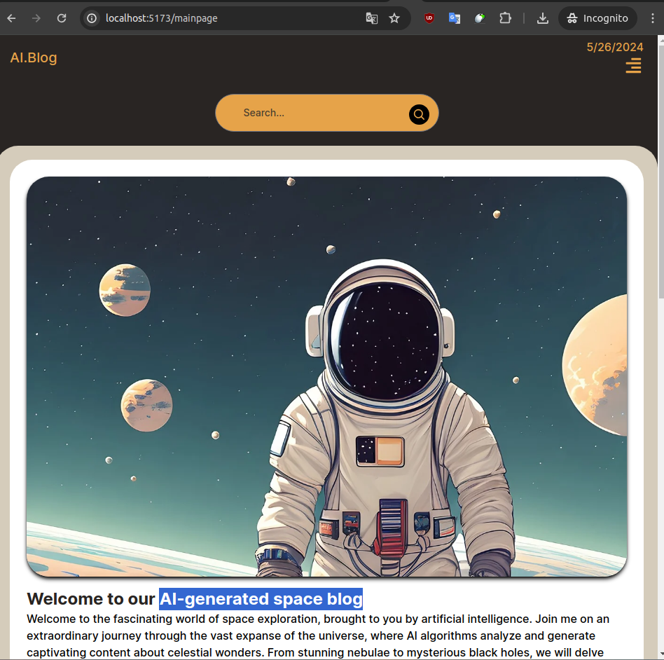
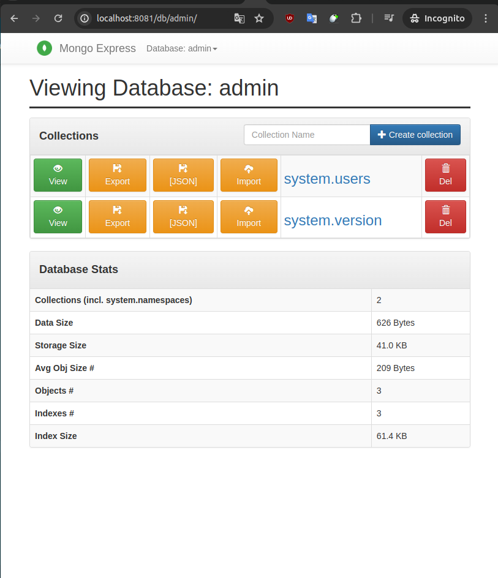

# CRAWLER (FLASK,MONGODB,MONGO_EXPRESS)
## Description
- This is a simple api for web crawler using flask, mongodb.
## Folder structure
```
    ├── app                     # Main folder
    │    ├── app.py             # api file
    │    ├── template           # Template folder to show view
    ├── ...                    
    ├── Dockerfile                     
    ├── docker-compose.yml                    
    ├── requirements.txt        # Dependencies to run           
    ├── ...
    └── README.md
```
## How to run
###  *Make sure you have docker or you can run it in local
> Using docker 
Check docker 
```
docker --version
``` 
```
Docker version 26.0.1, build d260a54
```
Let's build
```
docker compose build
```
After that run compose
```docker
docker compose up
```
And Hola:


---
> Using local
- You should have your mongo db run in local port 27017
```bash
pip install --no-cache-dir -r requirements.txt
```
Run app
```bash
cd app && flask run
```
### Access database 
> Using docker


## That done!